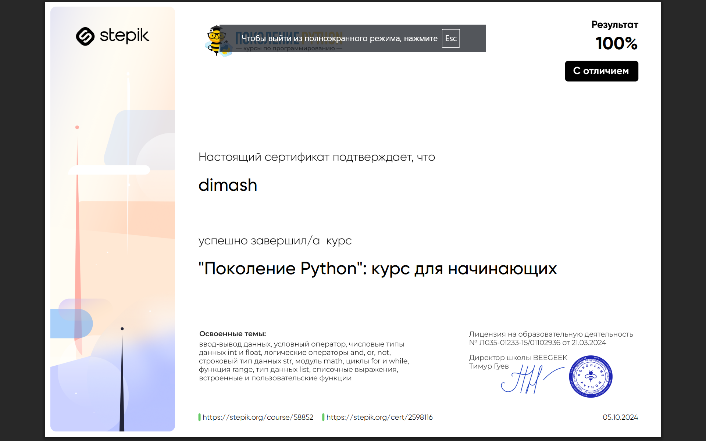
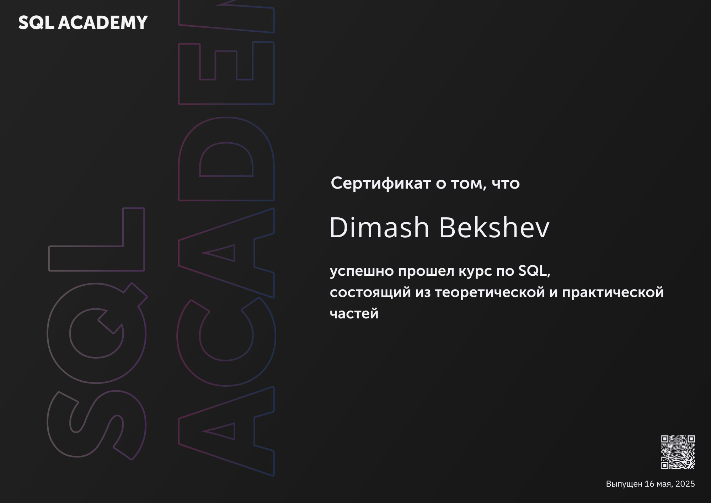

# Dimash Bekeshev  
### Data Science Enthusiast | Python Developer | Backend Engineer  

Hi! I'm Dimash — a Data Science student with a strong interest in analytics, web development, and backend engineering.  
I work with Python, FastAPI, PostgreSQL, Django, and I'm actively expanding into APIs, DevOps, and automation.

---

## 🧠 Areas of Interest
- Data processing and visualization (**NumPy**, **Pandas**, **Matplotlib**, **Seaborn**, **Plotly**)
- Machine learning and modeling (**scikit-learn**, **XGBoost**, **LightGBM**)
- REST API development (FastAPI, Django REST Framework)
- Database management (PostgreSQL, SQL, MySQL)
- Docker containerization and deployment

---

## 💼 Skills

### Languages

### Data Science & Analysis

### Backend & Web

### Databases

### Tools

---

## 📜 Certificates

  
  
  
  
  
  
  

---

## 📊 GitHub Stats

---

## 📫 Contact

  
  
